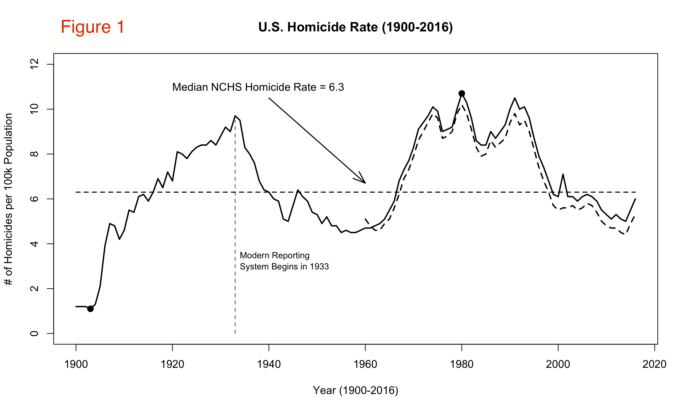
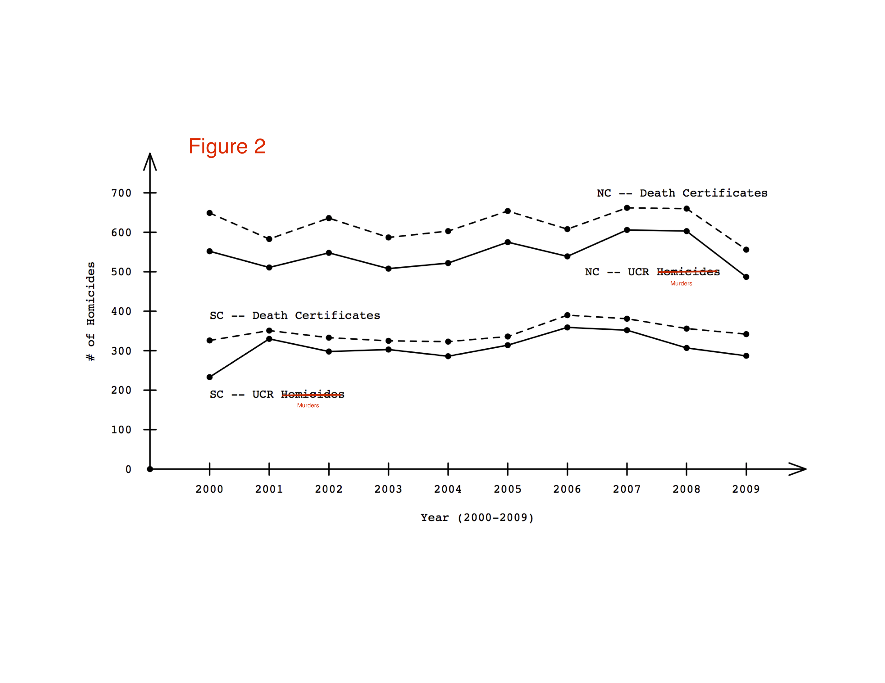
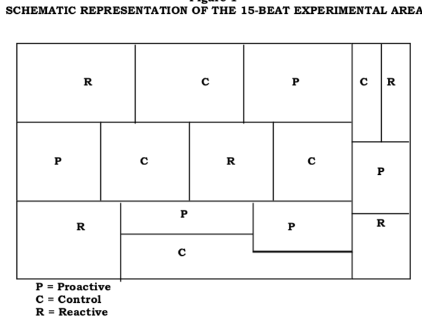
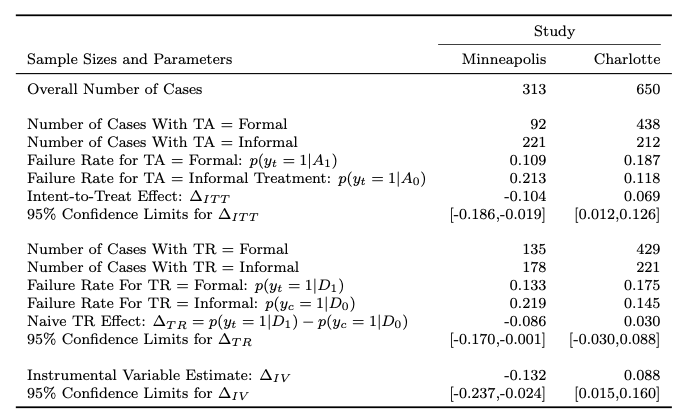
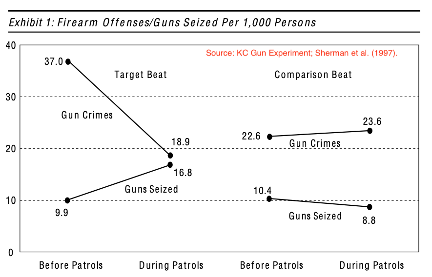
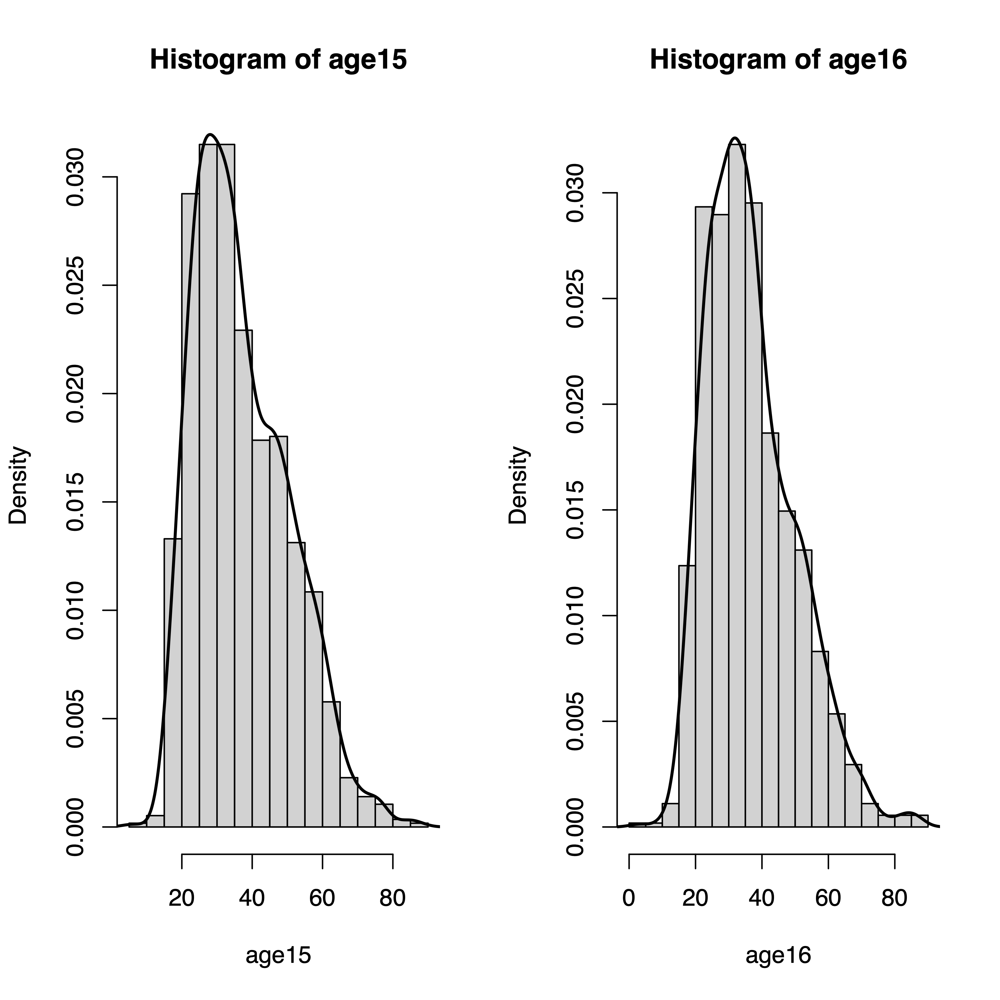
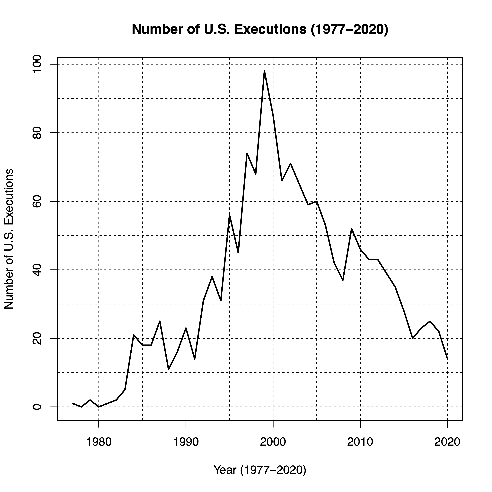
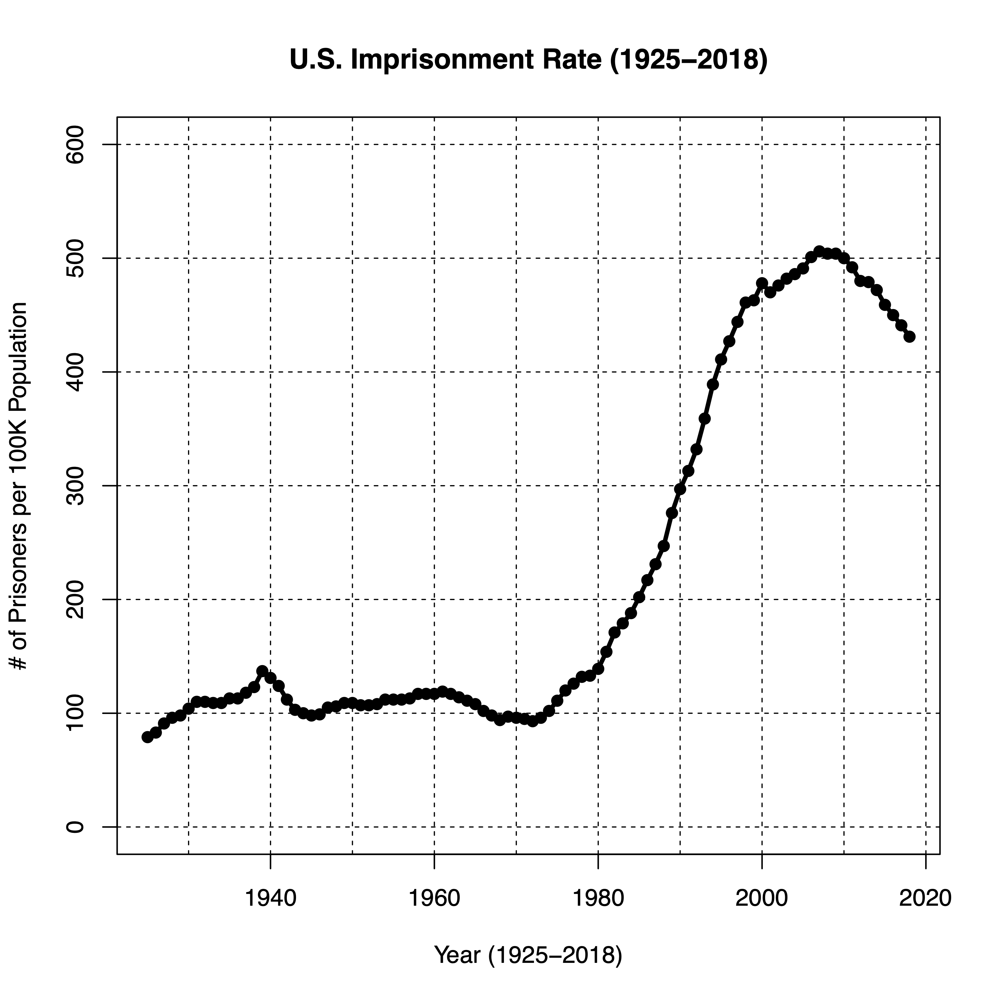
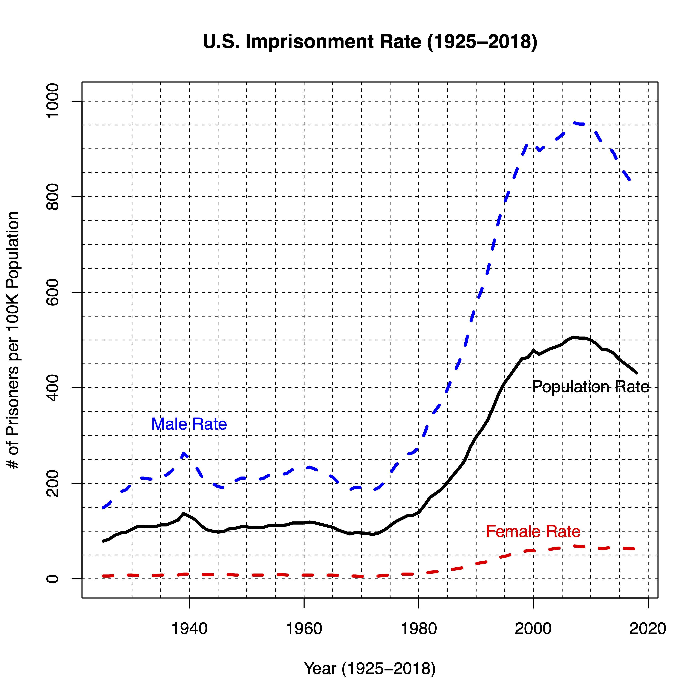

### American Criminal Justice System (CRJU 101-J11)

* Semester: Fall 2020
* Class Meets: Asynchronous, Online
* Instructor: Robert Brame 
* Email: rwb@sc.edu
* Online office meetings at 2:00-2:30(ET) on Tuesdays and by appointment.

#### Class Description

Survey of crime and societal responses to crime, including law enforcement, courts, corrections, and the juvenile justice system. 

#### Learning Outcomes

This course prepares you to: (1) comprehend problems around the definition of crime and crime measurement; (2) explain the structural and procedural foundations of the American legal system; and (3) properly describe the major components of the American criminal justice system including law enforcement, courts, corrections, and juvenile justice.

#### Textbook

Steven P Lab, Marian R. Williams, Jefferson E. Holcomb, Melissa W. Burek, William R. King, and Michael E. Buerger (2018). *Criminal Justice: The Essentials* (5th Edition). New York: Oxford University Press.

#### Disability Accommodations

If you have or think you might have a disability, injury, or other condition that could affect your class performance, please contact the [Student Disability Resource Center](https://sc.edu/about/offices_and_divisions/student_disability_resource_center/). I will abide by accommodations recommended by the Disability Resource Center in this course.

#### Academic Integrity Statement

You are expected to practice the highest standards of academic integrity. Any deviation from this expectation will result in a minimum academic penalty of your failing the assignment, and may result in additional disciplinary measures. This includes improper citation of sources, presenting someone else's work as your own, and any other form of academic misrepresentation. Please take a few moments to familarize yourself with the University's expectations for student academic integrity which can be found [here](http://www.sc.edu/policies/ppm/staf625.pdf).

#### Class Format

We have about 14 weeks of class time this semester. With an in-person class, we normally meet 150 minutes per week. I plan to approximate this same level of lecture time (using video recordings) in this asynchronous online course. All course content will be posted on this webpage. You are responsible for developing and maintaining a regular schedule of: (1) monitoring the course webpage for both content and course-related announcements; (2) doing your assigned reading; (3) reviewing the posted content; and (4) completing your assignments in a timely fashion. Please feel free to email me with any questions (either content or logistics).

#### Class Grades

Your grade in this class will be based on your performance on assignments distributed throughout the semester. Each assignment will include a set of 7 short-answer questions that must be completed within a 35-minute time window (the 35 minute clock will begin to tick once you start the assignment). You can answer each of the questions in no more than 2 or 3 sentences and you are free to use your book and your notes during each assignment but you are required to work independently -- with no assistance from any other person. The questions will be based on reading and lecture material we have covered since the last assignment. Each question will be worth one point toward your final grade at the end of the semester. Letter grades will be assigned as follows: A = 90 or more points; B+ = 85-89 points; B = 80-84 points; C+ = 75-79 points; C = 70-74 points; D+ = 65-69 points; D = 60-64 points; F = 59 or fewer points. You can accumulate partial credit for questions when appropriate. Therefore, if you end up with fractional points at the end of the semester, I will round up or down to the nearest round number (i.e., an 89.1 will give you a B+ but an 89.6 will give you an A). You are welcome to discuss grade issues with me during an online office meeting. Please don't send me [emails](https://www.digitaltrends.com/computing/can-email-ever-be-secure/) about your grades.

#### Late Submissions

Each week, the assignment will be open on Blackboard on Thursday and Friday giving you two full days to complete the work. The work will be due on Friday evening by 11:59pm (ET). If you have an extenuating circumstance that requires you to submit an assignment late, I will hear your concern and consider whether a late submission is appropriate. Examples of extenuating circumstances include your or a family member's illness or an incapacity to complete the work due to circumstances beyond your control. Forgetting about the due date for an assignment is not an extenuating circumstance.  

#### Required Technology

Weekly assignments will be posted on Blackboard and you should complete your assignments and monitor your grades there. It is your responsibility to have a properly functioning computer and web access so you can successfully learn the material in this course. 

#### Course Outline

* Week 1 (Thursday 8/20/20 - Friday 8/28/20): Chapter 1 - Definitional and measurement issues; Assignment 1: Friday 8/28/20

* Week 2 (Saturday 8/29/20 - Friday 9/4/20): Chapter 1 - Definitional and measurement issues (continued); Assignment 2: Friday 9/4/20

* Week 3 (Saturday 9/5/20 - Friday 9/11/20): Chapter 2 - Issues of Law; Assignment 3: Friday 9/11/20

* Week 4 (Saturday 9/12/20 - Friday 9/18/20): Chapter 2 - Issues of Law (continued); Assignment 4: Friday 9/18/20

* Week 5 (Saturday 9/19/20 - Friday 9/25/20): Chapter 3 - Policing and Law Enforcement; Assignment 5: Friday 9/25/20

* Week 6 (Saturday 9/26/20 - Friday 10/2/20): Chapter 3 - Policing and Law Enforcement (continued); Assignment 6: Friday 10/2/20

* Week 7 (Saturday 10/3/20 - Friday 10/9/20): Chapter 4 - Court System; Assignment 7: Friday 10/9/20

* Week 8 (Saturday 10/10/20 - Friday 10/16/20): Chapter 4 - Court System (continued); Assignment 8: Friday 10/16/20

* Week 9 (Saturday 10/17/20 - Friday 10/23/20): Chapter 5 - Institutional Corrections; Assignment 9: Friday 10/23/20

* Week 10 (Saturday 10/24/20 - Friday 10/30/20): Chapter 5 - Institutional Corrections (continued); Assignment 10: Friday 10/30/20

* Week 11 (Saturday 10/31/20 - Friday 11/6/20): Chapter 6 - Community Corrections; Assignment 11: Friday 11/6/20

* Week 12 (Saturday 11/7/20 - Friday 11/13/20): Chapter 6 - Community Corrections (continued) + Chapter 7 - Juvenile Justice; Assignment 12: Friday 11/13/20

* Week 13 (Saturday 11/14/20 - Friday 11/20/20): Chapter 7 - Juvenile Justice (continued); Assignment 13: Friday 11/20/20

* Week 14 (Saturday 11/21/20 - Tuesday 12/1/20): Chapter 7 - Juvenile Justice (continued) + Chapter 8 - Conclusions; Assignment 14: Final Exam Week

### Lesson 1 - Wednesday 8/19/20

* Lecture link is [here](https://youtu.be/OfMG4ceDEc0).
* Please note that I've turned on close-captioning for the lecture videos.
* Current reading: Chapter 1 of your textbook.
* First assignment will be open from Thursday 8/27/20 - Friday 8/28/20.

### Lesson 2 - Friday 8/21/20

* Lecture link is [here](https://youtu.be/AXmOV5BCRjQ).
* Current reading: Chapter 1 of your textbook (start reading as soon as you can get your book).
* First assignment will be open from Thursday 8/27/20 - Friday 8/28/20.

##### Key points from this lecture

* Defining criminology and criminal justice.
* Identifying strengths and weaknesses in the science of criminology.
* Considering the meaning of the word "justice."
* The idea of federalism
* Separation of powers

### Lesson 3 - Saturday 8/22/20

* Lecture link is [here](https://youtu.be/RJ6L1C1XWls).

<p align="center">

</p>

##### Key points from this lecture

* The idea of theory.
* Relationship between theory and policy.
* Age-arrest and age-crime curves.
* Criminal recidivism.
* Link between criminal recidivism and age-arrest curves.
* The idea of a recidivism rate.

### Lesson 4 - Sunday 8/23/20

* Lecture link is [here](https://youtu.be/weJWB_wqVyU).
* Link to the [Minneapolis Domestic Violence Experiment](https://web.archive.org/web/20070705011333/http://www.policefoundation.org/pdf/minneapolisdve.pdf)

##### Key points from this lecture

* Considering the link between research, theory, and policy.
* The Minneapolis Domestic Violence Experiment (MDVE) is a good example of this link.
* Motivation for the MDVE
* Theoretical ideas within the MDVE
* How the MDVE was carried out.
* Treatments used and outcomes measured.
* MDVE results
* Policy impact of the MDVE

### Lesson 5 - Monday 8/24/20

* Lecture link is [here](https://youtu.be/FMtpO5IK_C0).

* Announcement: Lesson 5 is the last lecture for the first assignment. 

* Note: Beginning this week, a 30-35 minute lecture will be posted each day from Saturday-Tuesday. The material in these lectures will be covered on each week's assignment due on Thursday-Friday; *please remember you will have 35 minutes to work on the assignment and you must complete the assignment in one sitting so be sure to pick a time on Thursday or Friday when you can work on the assignment uninterrupted for 35 minutes*. You do not have to watch the lectures on the days they are posted. You do need to review them before you work on the assignment each week. I will do my best to have the Tuesday lecture posted before office hours on Tuesday afternoon.

* Here are a few practice questions to give you an idea of the kinds of questions I will be asking on the assignments.

1. What is a theory? - Example Answer: a description of a process that generates observed data.
2. Describe the age-arrest curve. - Example Answer: the age-arrest curve tells us that arrest rates rise dramatically during early adolescence, peak in late adolescence and early adulthood, and then decline for the rest of the lifespan.
3. Explain what we mean by the term "recidivism." - Example Answer: Recidivism is new offending among people who have offended in the past.
4. Identify the main strength and the main weakness of the science of criminology. - Example Answer: Criminologists are good at describing patterns of criminal behavior but not so good at explaining that behavior.
5. What is federalism? - Example Answer: federalism pertains to the idea that power should be separated among different entities rather than invested in a single person or agency. In the United States, power is distributed between federal, state, and local governments, and most jurisdictions distribute power between legislative, executive, and judicial branches of government.

##### Key points from this lecture

* Research always has strengths and weaknesses.
* Strengths and weaknesses of the MDVE.
* Crime measurement overview.
* Three principal ways of measuring crime.
* Each measurement approach has strengths and weaknesses.
* Looking at crime in Columbia and Charleston as an example
* This lecture concludes the material being covered for the first assignment due on Friday 8/28/20.

<p align="center">

</p>

### Lesson 6 - Saturday 8/29/20

* Lecture link is [here](https://youtu.be/R1r__5RNcI0).

* Announcement: Lesson 6 is the first lecture for the second assignment. Today's material is based on Chapter 1 of the textbook.

##### Key points from this lecture

* Crime vs. deviance
* Social control
* Mala in se and mala prohibitum offenses
* Felonies and misdemeanors
* State's role in criminal cases

### Lesson 7 - Sunday 8/30/20

* Lecture link is [here](https://youtu.be/7FJ-uhTJIJA).
* Classical School
* Positive School
* Four main purposes of punishment: (1) Retribution; (2) Deterrence; (3) Rehabilitation; and (4) Incapacitation

### Lesson 8 - Monday 8/31/20

* Lecture link is [here](https://youtu.be/k0EjOhKMaGo).
* Four main purposes of punishment: (1) Retribution; (2) Deterrence; (3) Rehabilitation; and (4) Incapacitation (continued)
* Dark figure of crime

### Lesson 9 - Tuesday 9/1/20

* Lecture link is [here](https://youtu.be/5nAp-wit-EQ).
* Textbook reading: Chapter 1 (continued); pp. 1-14.
* Note: Lesson 9 is the final lesson covered on Assignment #2 (Thursday 9/3/20 - Friday 9/4/20).
* More on incapacitation as a purpose of punishment (#4 from Lesson 8).
* Three ways of measuring crime: (1) Official statistics; (2) Victimization surveys; and (3) Self-report surveys

### Lesson 10 - Saturday 9/5/20

* Lecture link is [here](https://youtu.be/vfAZVtsPcxc).
* *Note*: Today's lesson is the first lesson for Assignment #3 which will occur on Thursday 9/4 and Friday 9/5.
* We are still examining crime measurement issues on pages 12-14 in the textbook.
* Please make sure you have 35 minutes set aside to do the assignments when you start them. Once you begin an assignment you have to complete it in one sitting.
* Crime counts vs. crime rates
* A rate includes both a numerator (# of crimes) and a denominator (measure of population size)
* A rate also includes a multiplier to scale the fraction (i.e., # of crimes per 100,000 population)
* So, an example calculation is: (# of crimes/# of people) x 100,000
* Homicides/murder are generally the best measured crime.
* In general, we have two distinct ways of measuring homicides/murders in the United States (see below).

```rout
Example 1

* Suppose we have two cities: 
    - (1) a city with 150,000 people; 
    - (2) a city with 200,000 people.
* Now, suppose each city has 150 robberies in a particular month.
* What is the robbery rate for the two cities?
* 150/150,000 x 100,000 = 100 per 100K population
* 150/200,000 x 100,000 = 75 per 100K population.
```

```rout
Example 2

* Suppose we have two cities and both cities 
  have 100,000 population.
* One city has 125,000 people inside the city 
  each day (potential robbery targets)
* The other city has 175,000 people inside the city each day.
* Now, suppose each city has 150 robberies in a particular month.
* Each city will have the same robbery rate in the UCR (150) 
* But, this could be misleading.
* 150/125000 x 100,000 = 120 per 100K population
* 150/175000 x 100,000 = 86 per 100K population.
```

```rout
Example 3

* Burglaries in Greensboro and Charlotte
* Greensboro had 3,766 burglaries in 2009.
* Charlotte had 7,766 burglaries in 2009.
* Population in Greensboro in 2009 was 253,191.
* Population in Charlotte in 2009 was 777,708.
* Burglary rate in Greensboro: (3766/253191) x 100,000 = 1487
* Burglary rate in Charlotte: (7766/777708) x 100,000 = 999
```

<p align="center">

</p>

<p align="center">

</p>

<p align="center">

</p>

<p align="center">

</p>

### Lesson 11 - Sunday 9/6/20

* Lecture link is [here](https://youtu.be/IefOY6i_GnA).
* We are continuing today with our discussion of crime measurement (pp. 12-14 in the textbook).
* Today, we focus on the National Crime Victimization Survey.
* Nationally representative household survey.
* Conducted each year since 1973.
* Each fall, a new report is published showing what's occurred in the preceding year.
* I have compiled a series of NCVS results going back to 1973; here is a [link](https://github.com/rwb/ncvs/blob/master/README.md).
* NCVS covers household and personal crimes but not commercial victimizations.
* For personal crimes, the NCVS only examines people who were 12 years old and older.
* NCVS is a voluntary survey; carried out by the U.S. Census Bureau.
* NCVS helps us understand the dark figure of crime (discussed previously). An [example](https://www.bjs.gov/content/pub/pdf/cv18.pdf).

### Lesson 12 - Monday 9/7/20

* Lecture link is [here](https://youtu.be/lfb-5P3YsV0).
* Today, we complete our discussion of crime measurement by discussing self-report surveys (completes material on pp. 12-14).
* Self-report surveys examine what people say when they are questioned about their own offending behavior.
* These surveys confirm the large dark figure of crime revealed by crime victimization surveys.
* There are two broad types of surveys: cross-sectional and panel studies.
* A strength is that they give us another window into the characteristics of offenders and the crimes they commit.
* There are three major weaknesses with these surveys: (1) sampling problems; (2) accuracy of reports; and (3) attrition (in panel surveys).
* Here is an [example](https://www.prisonlegalnews.org/media/publications/pediatrics_journal_cumulative_prevalence_of_arrest_from_ages_8-23_in_a_national_sample_2011.pdf) of information we can learn from a self-report survey.
* The idea of the social contract (pp. 14-15).
* Crime control and due process models (p. 15).

### Lesson 13 - Tuesday 9/8/20

* Lecture link is [here](https://youtu.be/rLOSI1QDOY4).
* Announcement: if you choose to come to office hours, please note that I generally only see one student at a time. This means you might be in the "waiting room" for a few minutes while I talk to another student. I will let you in as soon as I can under these circumstances.
* Today's lesson is the last material for Assignment #3 which will be posted from Thursday 9/10 - Friday 9/11.
* Philosophical fluidity (retribution, deterrence, incapacitation, and rehabilitation).
* Federalism (separation and dispersion of power).
* Discretion (autonomous decision making).
* Components (four C's) of the criminal justice system.
* Citizens - reporting of crime, interaction with police, serving on juries, mandated reporting, no-drop policies.
* Cops - major predictors of arrest decisions.
* Courts - courtroom work group.
* Corrections - community and institutional.
* Recent developments - victims, social media, and use of force.
* This completes Chapter 1 and the material for Assignment #3.

### Lesson 14 - Saturday 9/12/20

* Lecture link is [here](https://youtu.be/91aRr3ZzmLw).
* Today's lesson is the first material (pp. 25-30) for Chapter 2 and Assignment #4 which will be posted from Thursday 9/17 - Friday 9/18.
* We define the term "law" and consider how laws are made in the United States (p. 26).
* The U.S. Constitution and the idea of constitutional law (p. 26).
* When a law is created, that law applies to a specific jurisdiction (p. 26).
* Key concept: the rule of law (p. 27)
* Customs, traditions, mores, and laws (p. 27)
* Common law and precedent (stare decisis; p. 27)
* Consistency and predictability in the law (echoes of Cesare Beccaria who we discussed previously; p. 27)
* Substantive and procedural laws (p. 30)
* Differences between civil law and criminal law (p. 30).

### Lesson 15 - Sunday 9/13/20

* Lecture link is [here](https://youtu.be/Pr-YvmNGcXo).
* Principle of legality (p. 30)
* Legal requirements for a crime to occur: *actus reus* and *mens rea* (p. 31)
* Acts of omission vs. acts of commission (p. 31)
* Strict liability (p. 32)
* Cause and effect in the criminal law (direct, concurrent, and proximate causes; p. 32)
* Harm requirement (pp. 32-33)
* Harm in the case of crimes like drug use and drug selling (p. 33).
* Crimes against persons -- violent crimes (p. 33).
* Property crimes (p. 34)
* Public order offenses (pp. 34-35)
* Drug offenses (p. 35).
* White-collar offenses (pp. 35-36).

### Lesson 16 - Monday 9/14/20

* Lecture link is [here](https://youtu.be/dnNnQzHbUOA).
* We previously discussed the concept of *actus reus* and how this is a necessary - but generally insufficient - basis for determining that a crime has occurred (p. 36).
* This implies that we can have an action that would often be construed as a crime but still not have an actual crime.
* Justification is the idea that a person's actions - even if they would often be considered criminal - were reasonable under the circumstances (p. 37).
* Sometimes we do not have a crime (even with a serious action) because the person's behavior can be excused (at least in the eyes of the law; p. 37-38).
* Commonly invoked excuses are: (1) insanity; (2) duress; (3) involuntary intoxication; and (4) age (pp. 37-39).
* The textbook treats insanity on its own footing (pp. 38-39) and considers the M'Naghten Rule and the "substantial capacity" test.
* Victims' rights under the law (p. 39).

### Lesson 17 - Tuesday 9/15/20

* Lecture link is [here](https://youtu.be/iE5ySfPBIZ8).
* Today's lesson is the last material covered in Assignment #4 which will be posted on Thursday 9/17 and Friday 9/18.
* We will skip over the section called "Recent Trends in Substantive Criminal Law" (pp. 40-43) but I will put an extra credit question on this week's assignment that covers this material. The extra credit question will be worth one point.
* Overview of procedural legal issues (pp. 43-44).
* Legal rights explicitly mentioned in the main body of the Constitution (p. 44).
* Constitutional amendments and amendment process (pp. 44-45).
* U.S. Supreme Court has the power to interpret the constitution (and declare laws unconstitutional).
* Supreme Court asserted this power for itself in *Marbury v. Madison* (1803) when it declared the Federal Judiciary Act of 1789 unconstitutional.
* Many different American courts can rule on issues of constitutional law but the Supreme Court has the final say.
* Some amendments are particularly significant for American criminal justice: 4th, 5th, 6th, 8th, and 14th (pp. 46-51).
* 4th Amendment: probibition against unreasonable searches and seizures (p. 46).
* 5th Amendment: grand jury indictments, double jeopardy, privilege against self-incrimination, and due process clause (p. 47).

### Lesson 18 - Saturday 9/19/20

* Lecture link is [here](https://youtu.be/J3AIopNTlrE).
* Today's lecture is the beginning of the material covered on Assignment #5 (9/24-9/25)
* Description of the U.S. Supreme Court and appellate process (pp. 43-51).
* Continuation of 4th and 5th Amendments (pp. 46-47).
* 6th Amendment (p. 48) - speedy trial, public trial, jury trial, and right to counsel
* 8th Amendment (p. 49) - excessive bail/fines, cruel and unusual punishments.

### Lesson 19 - Sunday 9/20/20

* Lecture link [here](https://youtu.be/tWJRK4sa5uI).
* Search warrants, probable cause, and the exclusionary rule; *Mapp v. Ohio* (1961) (page 46).
* Good faith exception to the exclusionary rule (p. 46).
* Double jeopardy (*In re Winship*, 1970) and self-incrimination (*Miranda v. Arizona*, 1966) (p. 47).
* Jury trial (*Duncan v. Louisiana*, 1968) and right to counsel (*Gideon v. Wainwright*, 1963) (p. 48).
* Cruel and unusual punishment (*Robinson v. California*, 1962; *Furman v. Georgia*, 1972; *Gregg v. Georgia*, 1976)
* Fourteenth Amendment (1868; due process and equal protection clauses)

### Lesson 20 - Monday 9/21/20

* Lecture link is [here](https://youtu.be/KltC_q-ubdc)
* Judicial review (p. 50)
* Incorporation (pp. 50-51)
* First example of incorporation: *Chicago, Burlington & Quincy Railroad Co. v. City of Chicago* (1897).
* First incorporation in a criminal case: *Gitlow v. New York* (1925).
* A recent example of 4th Amendment litigation related to searches and seizures: *Maryland v. King* (2013; [link](https://www.supremecourt.gov/opinions/12pdf/12-207_d18e.pdf))
* This case provides us with a bridge from Chapter 2 to Chapter 3 (criminal law to policing).
* Policing serves as the gateway to the American criminal justice system.
* Fraction of people who ever get arrested by the police (by age 23) ([link](https://www.prisonlegalnews.org/media/publications/pediatrics_journal_cumulative_prevalence_of_arrest_from_ages_8-23_in_a_national_sample_2011.pdf)).

### Lesson 21 - Tuesday 9/22/20

* Lecture link is [here](https://youtu.be/x6aATSyabTk).
* Today's lesson is the last material covered on Assignment #5 which will be posted from Thursday 9/24 to Friday 9/25.
* Today we begin the material covered in Chapter 3 (pp. 54-56).
* Police are gatekeepers for the criminal justice system.
* Three main sets of police responsibilities: law enforcement, order maintenance, and community service.
* An essential element of police work is discretion.
* Quality of police response often depends on public cooperation and confidence.
* Crime prevention - community coordination and patrol practices.
* Crime response - investigation, enforcement, and arrest.

### Lesson 22 - Saturday 9/26/20

* Lecture link is [here](https://youtu.be/GQCo7jknVFo).
* Today's lesson is the first material being covered on Assignment #6 which will be posted from Thursday 10/1 to Friday 10/2.
* We are continuing with Chapter 3 on policing (discussing pp. 54-59).
* Brief review of law enforcement role (pp. 54-56).
* Order maintenance (p. 56)
* Police and community service (pp. 56-57).
* Policing and society (pp. 57-59).
* Political, professional, and community-oriented eras of policing (not in book but several of the readings listed on p. 81 emphasize this historical evolution of the police).
* Intelligence-led policing (p. 59).
* Kansas City Preventive Patrol Experiment (p. 59)
* Minneapolis Domestic Violence Experiment (p. 59)

<p align="center">

</p>

<p align="center">

</p>

### Lesson 23 - Sunday 9/27/20

* Lecture link is [here](https://youtu.be/9XYWJ0K1R6w).
* Problem-oriented policing and evaluation in policing (p. 59).
* More on intelligence-led policing (p. 59): KC Preventive Patrol Experiment; Minneapolis DV Experiment
* Comp-stat and crime analysis technology (p. 59)
* Community-level interventions and evaluation in policing (not in reading).
* Example: Kansas City Gun Experiment [here - *optional* reading](https://www.ncjrs.gov/pdffiles/kang.pdf).

<p align="center">

</p>

### Lesson 24 - Monday 9/28/20

* Lecture link is [here](https://youtu.be/nZY6iDcQthE).
* Variation in policing and law enforcement agencies (pp. 60-64).
* Federal vs. state vs. local authority (due to federalism; pp. 60-62).
* The jurisdiction of the agencies at these different levels sometimes differs and sometimes overlaps (pp. 62-63).
* Local police vs. sheriff's departments (p. 60).
* Special police (universities, school districts, state offices, transit police) (p. 61).
* State police - patrol and investigation (p. 61).
* Federal law enforcement (pp. 61-63).
* U.S. Justice Department (FBI, U.S. Marshals Service, Bureau of Alcohol, Tobacco, and Firearms, Drug Enforcement Administration).
* U.S. Homeland Security Department (Secret Service, Customs and Border Protection, Immigration and Customs Enforcement, Coast Guard).
* Key changes in federal law enforcement structure when compare periods before and after 2003.
* Tribal law enforcement (p. 63).
* Private police (p. 64).

### Lesson 25 - Tuesday 9/29/20

* Lecture link is [here](https://youtu.be/7udOLd6xwB8).
* Today's material concludes the information covered on Assignment #6 which will be open from Thursday 10/1 to Friday 10/2.
* Hierarchical organization (p. 65)
* Police employees (p. 65)
* Specialized responsibilities (pp. 65-66)
* Patrol distrticts and beats; beat integrity (p. 66)
* Shift work (p. 67)
* Policing career pathways (pp. 67-68)
* Hiring processes for police agencies (pp. 68-69)
* Training and promotion (pp. 69-71)

### Lesson 26 - Saturday 10/3/20

* Lecture link is [here](https://youtu.be/RCEaV1x1Mw0).
* Today's lesson is the first material covered by Assignment #7 which will be posted on Thursday 10/8 to Friday 10/9.
* Training and promotion (continued -- pp. 69-71). 
* Cultural issues in American policing (pp. 71-72).
* Corruption, harassment, and use of force (pp. 72-76).
* Measurement of killings of police: 86 (45 accidental/41 criminal) officers killed in 2015 and 118 (52 accidental/66 criminal) were killed in 2016.
* Measurement of assaults of police: 50,212 officers assaulted in 2015; 57,180 officers assaulted in 2016 ([source](https://www.fbi.gov/news/stories/2016-leoka-report-released)).
* Measurement of police use of force
* Police killings database from *The Guardian* ([link](https://www.theguardian.com/us-news/series/counted-us-police-killings))
* Number of people killed by police in 2015: 1146.
* Number of people killed by police in 2016: 1093.
* Total number of people killed by police in both years combined: 2239.
* Average/median age of people killed by police in 2015: 37.1/35
* Average/median age of people killed by police in 2016: 36.8/35

<p align="center">

</p>

* Consider the table below. We can learn a few things from it.
* The fraction of people who are killed by police who are Black can't be precisely estimated but it can be bounded.
* Lower bound on number of Black persons killed is 573.
* Upper bound on number of Black persons killed is 573 + 41 = 614
* Lower bound on fraction of people killed who are Black is 573/2239 = 25.6% 
* Upper bound on fraction of people killed who are Black is 614/2239 = 27.4% 
* According to recent Census estimates, the U.S. population is 13.4% Black
* We will do some more work with this table in our next lesson.


| Weapon     | Race = Black | Race = Non-Black | Race = ? | Total |
|:-----------|-------------:|-----------------:|---------:|------:| 
|No          | 121          | 281              | 3        | 405   | 
|Yes         | 414          | 1242             | 35       | 1691  | 
|Weapon = ?  | 38           | 102              | 3        | 143   | 
|Total       | 573          | 1625             | 41       | 2239  |

### Lesson 27 - Sunday 10/4/20

* Lecture link is [here](https://youtu.be/sJXtKKqonv4).
* The Guardian database doesn't have much detailed information about each case.
* This limits our ability to answer questions about why disparities might exist.
* One indicator that is in the data is the presence or absence of a weapon.
* So we can use the data to calculate the fraction of "no weapon" cases for each group.

| Parameter Description                                |  Estimate                     | 
|:-----------------------------------------------------|------------------------------:| 
|1. Fraction of "No Weapon" Cases - Black              | 121/(121+414) = 0.226         | 
|2. Fraction of "No Weapon" Cases - Non-Black          | 281/(281+1242) = 0.185        | 
|3. Delta: 1-2                                         | 0.226-0.185 = 0.041           | 
|4. 95% Confidence Interval for Delta                  | 0.003, 0.081                  |
|5. Lower Bound of Delta Considering Missing Cases     | -0.040                        |
|6. Upper Bound of Delta Considering Missing Cases     | 0.116                         |
|7. Confidence Limits on Bounds                        | -0.084, 0.159                 |

* The most significant problem with these data is the missing information on race and whether the person who was killed had a weapon.
* If the missing cases are randomly missing, then we can conclude that "no-weapon" cases occur more often among Black persons than among Non-Black persons.
* Yet the analysis shows that these missing cases create enough uncertainty that we can't draw strong conclusions.
* The problem in this example underscores the weaknesses of the kind of data we often have to study race disparities and other important issues related to police use of force.
* As the book suggests, our discussions of excessive police use of force tend to be dominated by the circumstances of specific cases (pp. 74-77).
* Discussion of specific cases is necessary and useful. Evidence that arisen in specific cases has led to criminal prosecutions for wrongdoing, legal judgments and settlements for victims' families, and important reforms and improvements.
* Still, we should not be in a position where rely exclusively on cases that happen to attract large amounts of attention.
* Instead, we should be developing a measurement infrastructure that will allow us to measure police use of force (both legitimate and excessive) in a systematic way.
* Issues related to mental health and immigrant populations are highlighted in the textbook as special concerns for contemporary policing (p. 77).
* Emerging challenges for policing: (1) technology; (2) decarceration; and (3) drug, toxic substance, and virus exposure (pp. 78-80).
* In our next lesson, we will transition to Chapter 4.

### Lesson 28 - Monday 10/5/20

* Lecture link is [here](https://youtu.be/miSHu1T2z_c).
* In today's lesson, we turn to the material in Chapter 4 - The Court System.
* The United States is organized into a system of federal and state courts -- each with its own jurisdiction (dual system, p. 83).
* Conflict of laws (pp. 83-84).
* Jurisdiction refers to the zone of cases that a court is empowered to adjudicate (p. 84).
* Example: juvenile vs. adult court (p. 84) and the complicating issue of judicial waiver.
* Adversarial justice system (p. 84).
* Packer's (1968) crime control and due process models of court case processing practices (p. 85).

### Lesson 29 - Tuesday 10/6/20

* Lecture link is [here](https://youtu.be/64xm6ToEZPk).
* In today's lesson, we continue moving through Chapter 4.
* Key language pertaining to courts in Article III of the Constitution: "The judicial power of the United States shall be vested in one supreme court, and in such inferior courts as the Congress may from time to time ordain and establish" (p. 86).
* This language pertains to the development of federal courts only; state courts were left to the individual states.
* During the very first Congress, the Judiciary Act of 1789 was passed by Congress and signed by President Washington (p. 86).
* This legislation established the first U.S. District Courts and Appeals Courts (pp. 86-87).
* The original federal districts were states and no federal districts crossed state lines (p. 86).
* Now, we have nearly 100 district courts (a number of states have more than one district) (p. 86).
* Federal district courts are courts of original jurisdiction (p. 86).
* The Judiciary Act of 1789 created three appellate courts covering different regions or "circuits" (southern, middle, and eastern) of the nation (p. 87).
* Today, there are 11 circuits (NC and SC are in the 4th circuit which is located in Richmond, VA) plus the DC circuit ([link to map here](https://www.uscourts.gov/sites/default/files/u.s._federal_courts_circuit_map_1.pdf))
* Appeals courts have no discretionary authority to accept or decline appeals. Any party who receives an adverse ruling in Federal District Court has the right to appeal the decision to the appropriate Circuit Court of Appeal (p. 87).
* Most appeals court cases are heard by a 3-judge panel but for some cases a broader group of judges will hear the case (*en banc* proceedings).
* The U.S. Supreme Court was also established by the Judiciary Act of 1789 (p. 88) but its role was poorly defined until *Marbury v. Madison* (1803).
* In *Marbury*, the Supreme Court established the principle of judicial review.
* The original structure of the Court was 5 associate justices and one chief justice; since 1869, the Court has had 8 associate justices and 1 chief justice.
* In most cases, the Supreme Court acts as an appeals court and makes the final decision on matters of constitutional law (p. 88).
* The Supreme Court has discretion over which appellate cases it will hear (if the Court chooses to hear an appeal it will issue a *writ of certiorari*) (p. 89).
* In some cases, such as disputes between states, the Supreme Court acts as a court of original jurisdiction. These are rare (pp. 88-89).
* This concludes the material we will cover for Assignment #7.

### Lesson 30 - Saturday 10/10/20

* Lecture link is [here](https://youtu.be/ei2zKZqzST8).
* In today's lesson (first lesson for Assignment #8), we continue working on Chapter 4.
* Most American criminal justice occurs at the state and local level - not the federal level.
* It follows that most criminal court work also occurs at the state and local level.
* Your textbook points out that about 85% of U.S. courts are original jurisdiction local limited jurisdiction trial courts (pp. 90-91).
* In South Carolina, these courts are called magistrate courts; North Carolina calls them district courts.
* Higher level trial courts are reserved for more serious offenses (In South Carolina, these courts are called "General Sessions" courts); your textbook calls these courts "Trial Courts of Original Jurisdiction" (p. 92).
* Many jurisdictions have a range of specialized courts dealing with certain kinds of offenses (drug courts, domestic violence courts, mental health courts etc.).
* State appeals courts (p. 92) and state supreme courts (pp. 92-93)
* Sometimes state supreme court cases can be appealed into the federal system but only if a federal constitutional issue is presented.
* Selection of state and federal judges (pp. 93-95).
* Prosecutors (pp. 96-97).
* Defense attorneys (pp. 97-99).

### Lesson 31 - Sunday 10/11/20

* Lecture link is [here](https://youtu.be/Mtjzh3uZJ2o).
* In today's lesson, we continue working on  Chapter 4.
* A little more on defense attorneys (pp. 97-99).
* Other courtroom workers (pp. 99-100).
* Judicial process related to arrest (p. 100).
* Initial appearance/arraignment (p. 100); some states make an important distinction between felonies and misdemeanors at this stage.
* Bail and pretrial detention (pp. 100-101).
* In the federal system, a grand jury indictment is required to charge someone with a felony; many - but not all - states also follow this same process (this [link](https://www.justice.gov/usao/justice-101/charging) from the U.S. Department of Justice has a good explanation).
* Preliminary hearing (pp. 101-102).
* Plea agreements (pp. 102-103).

### Lesson 32 - Monday 10/12/20

* Lecture link is [here](https://youtu.be/DVXgMmExG2A).
* Reminder about how to check on your grades in Blackboard (use course tools and then go under "My Grades"; click on the grade; you should be able to see what was marked correct, and what was marked incorrect on your assignments).
* In today's lesson, we continue working on Chapter 4.
* Charge and sentence bargains (pp. 102-103).
* Assembly-line justice (pp. 103-104 
* Case attrition (Figure 4.1 on p. 105)
* Criminal trials (pp. 104-106).
* Jury trials vs. bench trials (p. 104)
* Jury selection (pp. 104-105)
* Burden of proof in criminal proceedings (p. 106).
* Rules of evidence (p. 106).
* Conviction, acquital, and mistrial (p. 106)

### Lesson 33 - Tuesday 10/13/20

* Lecture link is [here](https://youtu.be/bQPoYC3HR98).
* Today's lesson is the last material covered on Assignment #8 (open on Thursday 10/15/20 - Friday 10/16/20).
* We conclude our discussion of Chapter 4 today.
* Our focus will be on dispositions of criminal cases in courts (pp. 106-110).
* Before I turn to sentencing, I want to briefly mention the related issues of charge dismissals, dropped charges, consent decrees, and pretrial intervention programs which are not significantly discussed in the textbook.
* Indeterminate sentencing (p. 107)
* Determinate sentencing (p. 107)
* Sentencing guidelines (pp. 107-108)
* Habitual offender statutes (p. 108)
* Mandatory minimum sentences (p. 108)
* Sanction types (pp. 108-109): fines, jail, prison, probation, split sentences, intermediate sanctions, and capital punishment.
* Constraints on punishment: 8th and 14th Amendments - "cruel and unusual punishments" are prohibited.
* Criminal case appeals (p. 110): postconviction reviews and collateral attacks (habeas corpus).
* Specialized courts: drug courts, mental health courts, and domestic violence courts (pp. 110-112).
* Increased victim involvement in judicial proceedings (restorative justice and alternative dispute resolution (p. 112-113).
* Court technology (pp. 113-114): case database management systems and video technology.
* Jury consultants (p. 114).

### Lesson 34 - Saturday 10/17/20

* Lecture link is [here](https://youtu.be/0SCel3jR4QE).
* Today's lesson is the beginning of the material covered on Assignment #9 (open on Thursday 10/22/20 - Friday 10/23/20).
* Today's lesson also begins our coverage of the material in Chapter 5 - Institutional Corrections.
* Institutional corrections refers to criminal punishment that takes the form of imprisonment (equivalently, incarceration).
* Historical methods of criminal punishment - fines, corporal punishment, capital punishment, and incarceration (pp. 117-118).
* Dominant use of incarceration throughout history - detention prior to some other form of punishment being administered (p. 118).
* Over time, corporal and physical punishments have become increasingly rare as social norms and expectations have changed (p. 118).
* A modern example of this evolution is the declining use of capital punishment (my chart but the data come from Death Penalty Information Center ([link](https://deathpenaltyinfo.org/executions/execution-database)).

<p align="center">

</p>

* As corporal and capital punishment have declined, the modern penitentiary has become the dominant form of criminal punishment for serious offenders (p. 118).
* The chart below shows the population incarceration trends over (nearly) the past century (my chart but the historical data come from the Sourcebook of Criminal Justice Statistics ([link](https://www.albany.edu/sourcebook/pdf/t6282012.pdf)) and the U.S. Bureau of Justice Statistics ([link](https://www.bjs.gov/content/pub/pdf/p18.pdf)).

<p align="center">

</p>

### Lesson 35 - Sunday 10/18/20

* Lecture link is [here](https://youtu.be/AGI9PyMFfwg).
* In today's lesson, we continue our coverage of Chapter 5 - Institutional Corrections.
* Incarceration for women (p. 119)
* This chart is an expansion of the chart I showed in the last class which breaks down the incarceration rate separately for males and females since 1925 (my chart but the historical data come from the Sourcebook of Criminal Justice Statistics ([link](https://www.albany.edu/sourcebook/pdf/t6282012.pdf)) and the U.S. Bureau of Justice Statistics ([link](https://www.bjs.gov/content/pub/pdf/p18.pdf)).

<p align="center">

</p>

* In the section on incarceration for women, your book identifies three important time periods: (1) neglect era; (2) differential response period; and (3) equalization response period (pp. 119-121).

### Lesson 36 - Monday 10/19/20

* Lecture link is coming soon.
* In today's lesson, we continue our coverage of Chapter 5 - Institutional Corrections.
* There were different eras of punishment more generally (pp. 121-127).
* Era of the Penitentiary (p. 122).
* Two different models: Pennsylvania model (heavily influenced by the Quaker denomination) and the Auburn model (p. 122).
* Era of Reform (pp. 122-123).
* Cincinnati Prison Congress of 1870 led to a set of principles for penal reform (pp. 122-123) including the use of imate classification  systems, the abolition of the silent system, and establishment of parole.
