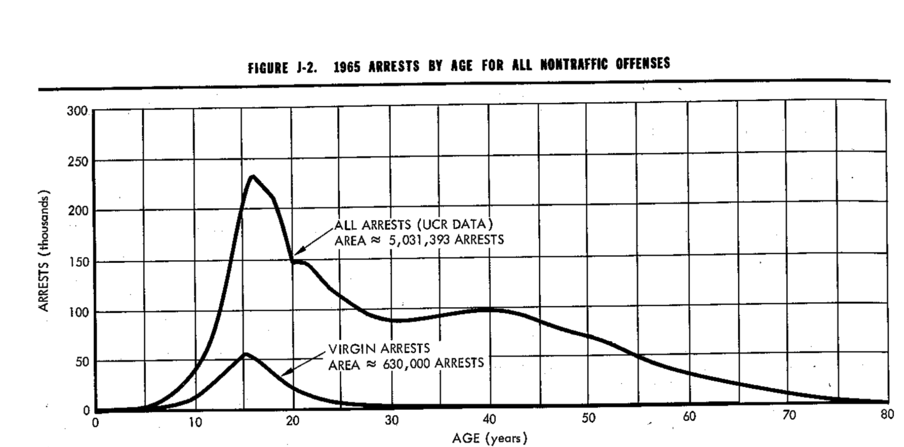
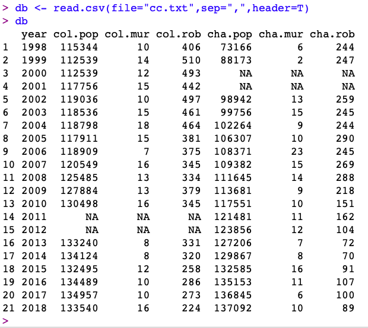
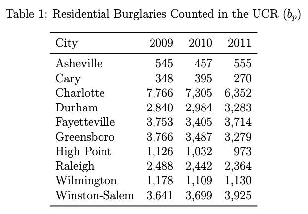
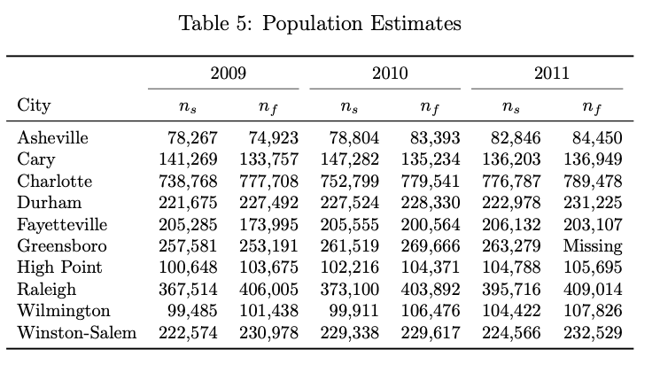

### American Criminal Justice System (CRJU 101-J11)

* Semester: Fall 2020
* Class Meets: Asynchronous, Online
* Instructor: Robert Brame 
* Email: rwb@sc.edu
* Online office meetings at 2:00-2:30(ET) on Tuesdays and by appointment.

#### Class Description

Survey of crime and societal responses to crime, including law enforcement, courts, corrections, and the juvenile justice system. 

#### Learning Outcomes

This course prepares you to: (1) comprehend problems around the definition of crime and crime measurement; (2) explain the structural and procedural foundations of the American legal system; and (3) properly describe the major components of the American criminal justice system including law enforcement, courts, corrections, and juvenile justice.

#### Textbook

Steven P Lab, Marian R. Williams, Jefferson E. Holcomb, Melissa W. Burek, William R. King, and Michael E. Buerger (2018). *Criminal Justice: The Essentials* (5th Edition). New York: Oxford University Press.

#### Disability Accommodations

If you have or think you might have a disability, injury, or other condition that could affect your class performance, please contact the [Student Disability Resource Center](https://sc.edu/about/offices_and_divisions/student_disability_resource_center/). I will abide by accommodations recommended by the Disability Resource Center in this course.

#### Academic Integrity Statement

You are expected to practice the highest standards of academic integrity. Any deviation from this expectation will result in a minimum academic penalty of your failing the assignment, and may result in additional disciplinary measures. This includes improper citation of sources, presenting someone else's work as your own, and any other form of academic misrepresentation. Please take a few moments to familarize yourself with the University's expectations for student academic integrity which can be found [here](http://www.sc.edu/policies/ppm/staf625.pdf).

#### Class Format

We have about 14 weeks of class time this semester. With an in-person class, we normally meet 150 minutes per week. I plan to approximate this same level of lecture time (using video recordings) in this asynchronous online course. All course content will be posted on this webpage. You are responsible for developing and maintaining a regular schedule of: (1) monitoring the course webpage for both content and course-related announcements; (2) doing your assigned reading; (3) reviewing the posted content; and (4) completing your assignments in a timely fashion. Please feel free to email me with any questions (either content or logistics).

#### Class Grades

Your grade in this class will be based on your performance on assignments distributed throughout the semester. Each assignment will include a set of 7 short-answer questions that must be completed within a 35-minute time window (the 35 minute clock will begin to tick once you start the assignment). You can answer each of the questions in no more than 2 or 3 sentences and you are free to use your book and your notes during each assignment but you are required to work independently -- with no assistance from any other person. The questions will be based on reading and lecture material we have covered since the last assignment. Each question will be worth one point toward your final grade at the end of the semester. Letter grades will be assigned as follows: A = 90 or more points; B+ = 85-89 points; B = 80-84 points; C+ = 75-79 points; C = 70-74 points; D+ = 65-69 points; D = 60-64 points; F = 59 or fewer points. You can accumulate partial credit for questions when appropriate. Therefore, if you end up with fractional points at the end of the semester, I will round up or down to the nearest round number (i.e., an 89.1 will give you a B+ but an 89.6 will give you an A). You are welcome to discuss grade issues with me during an online office meeting. Please don't send me [emails](https://www.digitaltrends.com/computing/can-email-ever-be-secure/) about your grades.

#### Late Submissions

Each week, the assignment will be open on Blackboard on Thursday and Friday giving you two full days to complete the work. The work will be due on Friday evening by 11:59pm (ET). If you have an extenuating circumstance that requires you to submit an assignment late, I will hear your concern and consider whether a late submission is appropriate. Examples of extenuating circumstances include your or a family member's illness or an incapacity to complete the work due to circumstances beyond your control. Forgetting about the due date for an assignment is not an extenuating circumstance.  

#### Required Technology

Weekly assignments will be posted on Blackboard and you should complete your assignments and monitor your grades there. It is your responsibility to have a properly functioning computer and web access so you can successfully learn the material in this course. 

#### Course Outline

* Week 1 (Thursday 8/20/20 - Friday 8/28/20): Chapter 1 - Definitional and measurement issues; Assignment 1: Friday 8/28/20

* Week 2 (Saturday 8/29/20 - Friday 9/4/20): Chapter 1 - Definitional and measurement issues (continued); Assignment 2: Friday 9/4/20

* Week 3 (Saturday 9/5/20 - Friday 9/11/20): Chapter 2 - Issues of Law; Assignment 3: Friday 9/11/20

* Week 4 (Saturday 9/12/20 - Friday 9/18/20): Chapter 2 - Issues of Law (continued); Assignment 4: Friday 9/18/20

* Week 5 (Saturday 9/19/20 - Friday 9/25/20): Chapter 3 - Policing and Law Enforcement; Assignment 5: Friday 9/25/20

* Week 6 (Saturday 9/26/20 - Friday 10/2/20): Chapter 3 - Policing and Law Enforcement (continued); Assignment 6: Friday 10/2/20

* Week 7 (Saturday 10/3/20 - Friday 10/9/20): Chapter 4 - Court System; Assignment 7: Friday 10/9/20

* Week 8 (Saturday 10/10/20 - Friday 10/16/20): Chapter 4 - Court System (continued); Assignment 8: Friday 10/16/20

* Week 9 (Saturday 10/17/20 - Friday 10/23/20): Chapter 5 - Institutional Corrections; Assignment 9: Friday 10/23/20

* Week 10 (Saturday 10/24/20 - Friday 10/30/20): Chapter 5 - Institutional Corrections (continued); Assignment 10: Friday 10/30/20

* Week 11 (Saturday 10/31/20 - Friday 11/6/20): Chapter 6 - Community Corrections; Assignment 11: Friday 11/6/20

* Week 12 (Saturday 11/7/20 - Friday 11/13/20): Chapter 6 - Community Corrections (continued) + Chapter 7 - Juvenile Justice; Assignment 12: Friday 11/13/20

* Week 13 (Saturday 11/14/20 - Friday 11/20/20): Chapter 7 - Juvenile Justice (continued); Assignment 13: Friday 11/20/20

* Week 14 (Saturday 11/21/20 - Tuesday 12/1/20): Chapter 7 - Juvenile Justice (continued) + Chapter 8 - Conclusions; Assignment 14: Final Exam Week

### Lesson 1 - Wednesday 8/19/20

* Lecture link is [here](https://youtu.be/OfMG4ceDEc0).
* Please note that I've turned on close-captioning for the lecture videos.
* Current reading: Chapter 1 of your textbook.
* First assignment will be open from Thursday 8/27/20 - Friday 8/28/20.

### Lesson 2 - Friday 8/21/20

* Lecture link is [here](https://youtu.be/AXmOV5BCRjQ).
* Current reading: Chapter 1 of your textbook (start reading as soon as you can get your book).
* First assignment will be open from Thursday 8/27/20 - Friday 8/28/20.

##### Key points from this lecture

* Defining criminology and criminal justice.
* Identifying strengths and weaknesses in the science of criminology.
* Considering the meaning of the word "justice."
* The idea of federalism
* Separation of powers

### Lesson 3 - Saturday 8/22/20

* Lecture link is [here](https://youtu.be/RJ6L1C1XWls).

##### Key points from this lecture

* The idea of theory.
* Relationship between theory and policy.
* Age-arrest and age-crime curves.
* Criminal recidivism.
* Link between criminal recidivism and age-arrest curves.
* The idea of a recidivism rate.

### Lesson 4 - Sunday 8/23/20

* Lecture link is [here](https://youtu.be/weJWB_wqVyU).
* Link to the [Minneapolis Domestic Violence Experiment](https://web.archive.org/web/20070705011333/http://www.policefoundation.org/pdf/minneapolisdve.pdf)

##### Key points from this lecture

* Considering the link between research, theory, and policy.
* The Minneapolis Domestic Violence Experiment (MDVE) is a good example of this link.
* Motivation for the MDVE
* Theoretical ideas within the MDVE
* How the MDVE was carried out.
* Treatments used and outcomes measured.
* MDVE results
* Policy impact of the MDVE

### Lesson 5 - Monday 8/24/20

* Lecture link is [here](https://youtu.be/FMtpO5IK_C0).

* Announcement: Lesson 5 is the last lecture for the first assignment. 

* Note: Beginning this week, a 30-35 minute lecture will be posted each day from Saturday-Tuesday. The material in these lectures will be covered on each week's assignment due on Thursday-Friday; *please remember you will have 35 minutes to work on the assignment and you must complete the assignment in one sitting so be sure to pick a time on Thursday or Friday when you can work on the assignment uninterrupted for 35 minutes*. You do not have to watch the lectures on the days they are posted. You do need to review them before you work on the assignment each week. I will do my best to have the Tuesday lecture posted before office hours on Tuesday afternoon.

* Here are a few practice questions to give you an idea of the kinds of questions I will be asking on the assignments.

1. What is a theory? - Example Answer: a description of a process that generates observed data.
2. Describe the age-arrest curve. - Example Answer: the age-arrest curve tells us that arrest rates rise dramatically during early adolescence, peak in late adolescence and early adulthood, and then decline for the rest of the lifespan.
3. Explain what we mean by the term "recidivism." - Example Answer: Recidivism is new offending among people who have offended in the past.
4. Identify the main strength and the main weakness of the science of criminology. - Example Answer: Criminologists are good at describing patterns of criminal behavior but not so good at explaining that behavior.
5. What is federalism? - Example Answer: federalism pertains to the idea that power should be separated among different entities rather than invested in a single person or agency. In the United States, power is distributed between federal, state, and local governments, and most jurisdictions distribute power between legislative, executive, and judicial branches of government.

##### Key points from this lecture

* Research always has strengths and weaknesses.
* Strengths and weaknesses of the MDVE.
* Crime measurement overview.
* Three principal ways of measuring crime.
* Each measurement approach has strengths and weaknesses.
* Looking at crime in Columbia and Charleston as an example
* This lecture concludes the material being covered for the first assignment due on Friday 8/28/20.

### Lesson 6 - Saturday 8/29/20

* Lecture link is [here](https://youtu.be/R1r__5RNcI0).

* Announcement: Lesson 6 is the first lecture for the second assignment. Today's material is based on Chapter 1 of the textbook.

##### Key points from this lecture

* Crime vs. deviance
* Social control
* Mala in se and mala prohibitum offenses
* Felonies and misdemeanors
* State's role in criminal cases

### Lesson 7 - Sunday 8/30/20

* Lecture link is [here](https://youtu.be/7FJ-uhTJIJA).
* Classical School
* Positive School
* Four main purposes of punishment: (1) Retribution; (2) Deterrence; (3) Rehabilitation; and (4) Incapacitation

### Lesson 8 - Monday 8/31/20

* Lecture link is [here](https://youtu.be/k0EjOhKMaGo).
* Four main purposes of punishment: (1) Retribution; (2) Deterrence; (3) Rehabilitation; and (4) Incapacitation (continued)
* Dark figure of crime

### Lesson 9 - Tuesday 9/1/20

* Lecture link is [here](https://youtu.be/5nAp-wit-EQ).
* Textbook reading: Chapter 1 (continued); pp. 1-14.
* Note: Lesson 9 is the final lesson covered on Assignment #2 (Thursday 9/3/20 - Friday 9/4/20).
* More on incapacitation as a purpose of punishment (#4 from Lesson 8).
* Three ways of measuring crime: (1) Official statistics; (2) Victimization surveys; and (3) Self-report surveys

<!-- * Crime counts vs. crime rates

<!-- 

<!-- 
<!-- 

<!-- 

<!-- 
<!-- 

